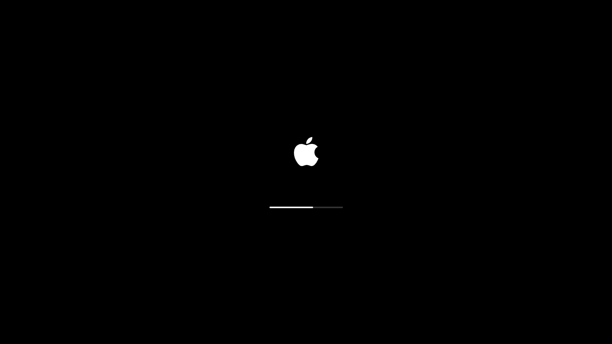
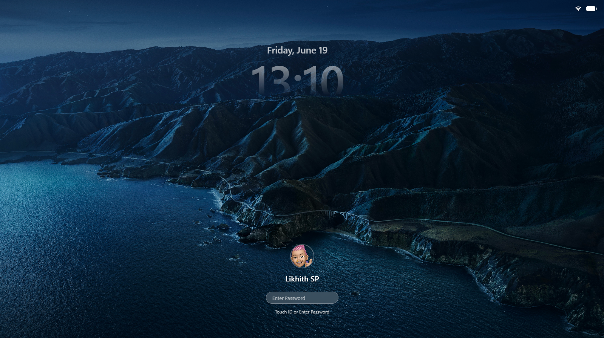
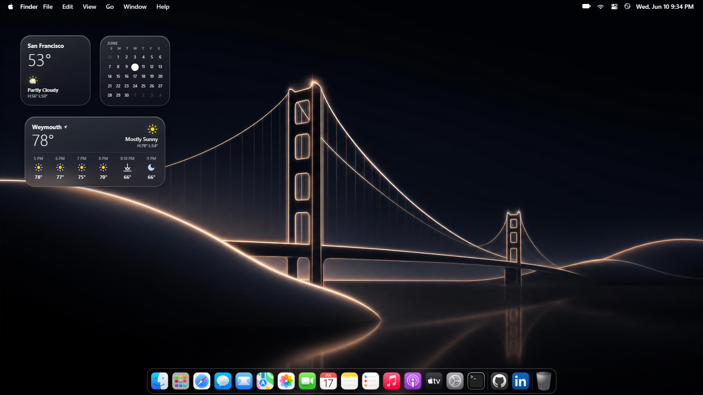
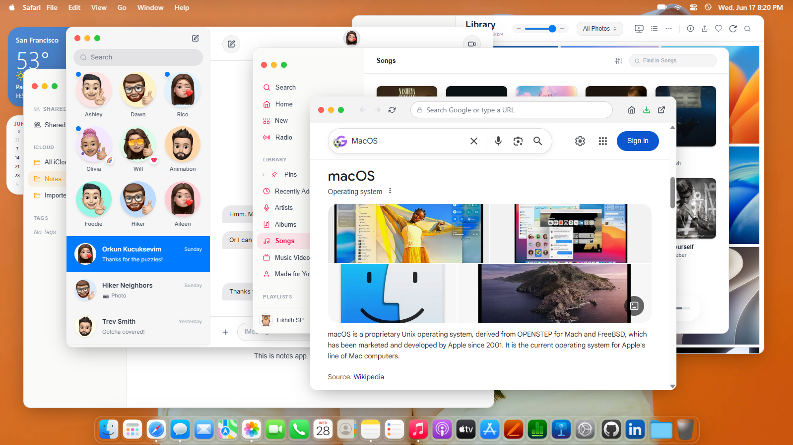

# Web simulation of MacOS






A fully interactive macOS-style web simulator built with React — complete with a start up and setup screens, boot sequence, lock screen, desktop environment, draggable app windows, a working dock, and real macOS UI polish.

---

## Features

- **Boot & Lock Screen** — Power-on animation, lock screen with clock, swipe-to-unlock, and auto-lock after 1 minute of inactivity
- **Editable Lock Screen Profile** — Click the avatar or name on the lock screen to upload a custom photo and rename the user; persisted in localStorage
- **Desktop Environment** — Draggable/resizable windows, right-click context menu, desktop folders and file creation
- **Dock** — Animated magnification effect on hover, app open/minimize indicators, bounce animation on launch
- **Top Bar** — Dynamic app title, Apple menu with lock/sleep/shutdown, dropdown menus, live clock
- **Finder** — Simulated file system with Downloads, Desktop, Documents, and Pictures folders; grid/list view
- **Safari** — Built-in browser with navigation controls
- **Terminal** — Functional terminal emulator
- **Photos / Gallery** — Image gallery with wallpaper setting support
- **Notes** — Apple Notes-style app with iCloud folders, tags, search, and a full editor; auto-saves to localStorage
- **Music / Spotify** — Spotify-integrated music player
- **Settings** — macOS System Settings replica with About This Mac overview
- **Wallpaper Customization** — Change desktop and lock screen wallpapers from the Gallery app

---

## Tech Stack

| Technology | Purpose |
|---|---|
| React 19 | UI framework |
| Vite 7 | Build tool & dev server |
| Tailwind CSS 4 | Styling |
| Framer Motion | Animations |
| GSAP | Advanced animations |
| Radix UI | Accessible UI primitives |
| React RND | Draggable/resizable windows |
| React Spring | Spring-based animations |
| Lucide React | Icons |

---

## Getting Started

### Prerequisites

- Node.js 18+
- npm or yarn

### Installation

```bash
git clone https://github.com/LikhithSP/MacOS-Web-Simulator.git
cd MacOS-Web-Simulator
npm install
```

### Development

```bash
npm run dev
```

Open [http://localhost:5173](http://localhost:5173) in your browser.

--- 

### Want to Contribute?

Contributions are welcome! 🚀

1. Fork the repository  
2. Create your feature branch

```bash
git checkout -b feature/your-feature-name
```

3. Commit your changes

```bash
git commit -m "Add: your feature"
```

4. Push to the branch

```bash
git push origin feature/your-feature-name
```

5. Open a Pull Request


## Project Structure

```
src/
├── App.jsx               # Root component, boot/lock/desktop stage manager
├── app/                  # Individual macOS apps
│   ├── Finder.jsx        # File manager
│   ├── Safari.jsx        # Web browser
│   ├── Terminal.jsx      # Terminal emulator
│   ├── Spotify.jsx       # Music player
│   ├── Gallary.jsx       # Photo gallery
│   ├── Settings.jsx      # System settings
│   ├── Trash.jsx         # Trash bin
│   └── Blogs/
│       └── BlogsSection.jsx  # Notes app

├── components/           # Shared UI components
│   ├── AppWindow.jsx     # Draggable/resizable window shell
│   ├── Dock.jsx          # macOS dock
│   ├── TopBar.jsx        # Menu bar
│   └── ContextMenu.jsx   # Right-click menu
├── layouts/
│   ├── DesktopWindow.jsx # Desktop environment
│   ├── LockScreen.jsx    # Lock screen
│   └── PowerScreen.jsx   # Boot/power screen
└── store/
    └── Appstore.js       # Window management store
```

---

## License

MIT
